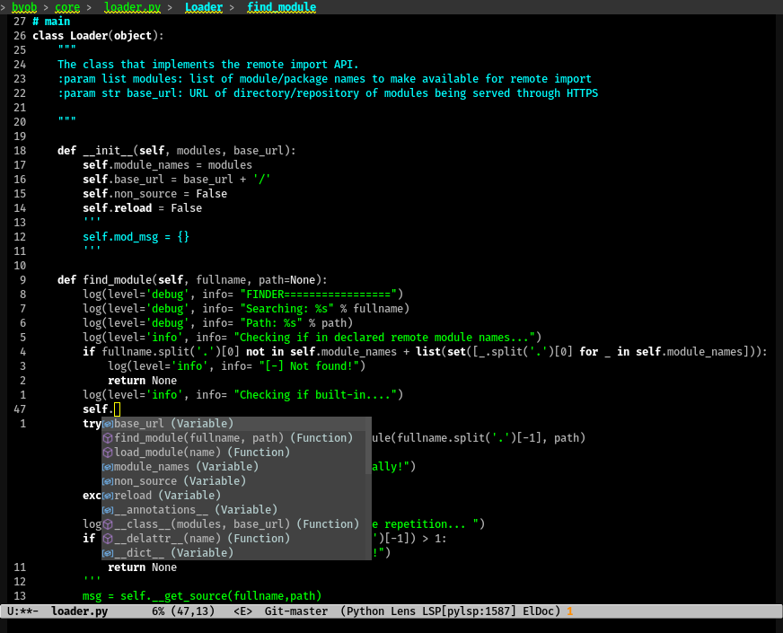

# notless emacs theme

it's a fork of Jason R. Blevins's emacs less theme with some modifications to
fit my taste.



## To add the theme

```lisp
(add-to-list 'custom-theme-load-path "/path/to/notless-theme.el")
(load-theme 'notless t)
```
